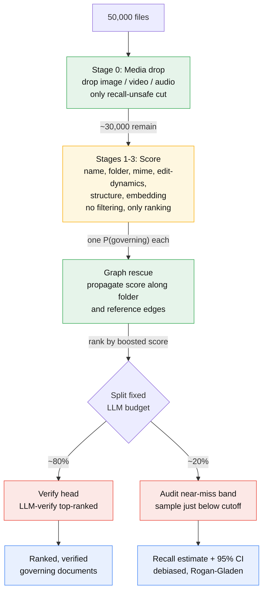
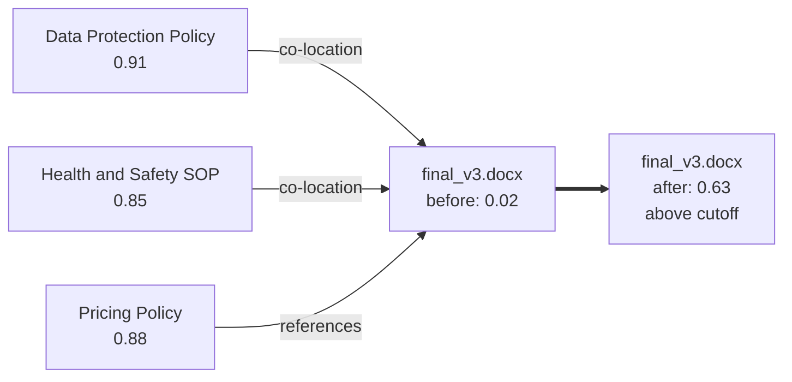

# System Design Document

A cost-bounded pipeline for surfacing governing documents in a large document store.

| | |
|---|---|
| Name | Abdullah Alshamam |
| Last updated | 2026-07-07 |
| Scope | Single Google Drive, one-shot scan |

## 1. System overview

It works as a cascading funnel that spends compute inversely proportional to
population size: free metadata signals run on all 50,000 files, cheap text and
embedding signals on the surviving few thousand, and the LLM on only a few
hundred. A governing document is identified by function, not topic: it is
authored internally, revised over years, reviewed by several people and
referenced elsewhere, all of which shows in metadata before a word is read. The
output is a ranked, LLM-verified set plus a measured recall estimate with a
confidence interval, the only honest completeness signal when nothing downstream
checks the result.

## 2. Assumptions

Below are assumptions on the context of the problem:

| Axis | Chosen | Alternative and how the design would change |
|---|---|---|
| Human in the loop | None, fully automated | A human confirming the shortlist would make active-learning labels free, allow a hotter and narrower funnel, and remove the model-collapse risk in the learning loop. The output here feeds an automated consumer such as a RAG index or a compliance store, which is why recall matters more than precision. |
| Cadence | One-shot batch scan | Continuous sync turns this into an incremental delta pipeline (Drive `changes` API) and unlocks live edit-dynamics. Watching a document be revised over time is a stronger governance signal than a single snapshot. |
| Objective | Recall-first | Precision-first would let the cheap stages hard-filter aggressively and return a tight set of ~80. This build over-includes into a confidence-ranked list and accepts higher token cost as the price of not missing a contract. |

## 3. Goals and non-goals

Goals:

- Surface the governing documents from a ~50k-file Drive at very low cost.
- Optimise for recall. Missing a contract is the expensive failure.
- Produce a measured recall estimate, not just a candidate list.
- Run fully automatically, with no human in the loop.
- Keep expensive-model spend bounded and independent of corpus size.

Non-goals:

- OCR of scanned or image-only documents.
- Continuous sync or incremental updates.
- Perfect precision. Some false positives are acceptable.
- A hard completeness guarantee, which is infeasible under the cost ceiling.

## 4. Pre-content signals

Every file exposes signals before its contents are read. The cheap stages rank on
these:

| Signal | What it suggests |
|---|---|
| Name | keywords like Policy, SOP, Contract are a strong prior |
| Type (MIME) | governing docs are Docs, Word or PDF, never photos or video |
| Size | policies are neither tiny nor huge |
| Path / folder | `/Policies`, `/Legal`, `/Compliance` signal intent |
| Owner / last editor | authored internally, not received from a vendor |
| Edit frequency | many revisions means a living document, not a one-off |
| Timestamps | a long created-to-modified span means it is maintained |

A governing document scores high on several of these at once; an invoice or photo
does not.

## 5. Architecture overview

Volume falls by orders of magnitude, represented in the colors below:

- 🟢 **Green**: free
- 🟡 **Amber**: cheap
- 🔴 **Red**: the expensive LLM

*Figure 1. Architecture diagram*

## 6. Design rationale

The constraint: recall must be high, but the LLM cannot read all 50,000 files.
So compute is spent in proportion to promise. Cheap signals run on everything;
the LLM runs only on the few hundred files that survive ranking, keeping spend
bounded and independent of corpus size (section 8). The cheap stages rank rather
than filter, since every hard drop risks a governing document and losses
compound. The only irreversible cut is the budget boundary.

Completeness cannot be proven cheaply, since that means reading everything. The
audit (section 7.5) measures it instead, reporting a recall estimate with a
confidence interval.

Alternatives considered:

| Approach | Why not chosen |
|---|---|
| Brute-force LLM over all 50k | Thousands of pounds and days per Drive. Kept only as the cost baseline (section 8). |
| Pure embedding search | Ignores the strongest cheap signals (folder, edit-dynamics, structure), and dense similarity is hard to threshold. Kept as one signal, not the system. |
| Pure keyword and rules, no LLM | Brittle: misses badly-named docs and novel cases, capping recall. Kept as the cheap early stages. |
| Supervised classifier upfront | No labelled data at cold start. Deferred to section 9, where LLM verifications become the labels. |
| Clustering or topic modelling | Governing docs are defined by function, not topic, so they never form a clean cluster; noise dominates. |
| Human-in-the-loop triage | Ruled out by the no-human assumption (section 2); the first thing to add if it relaxes. |

## 7. Detailed design

This section drills into each stage of the funnel (Figure 1).

### 7.1 Stage 0: media drop

One listing pass yields metadata for every file. The only hard drop is on files
that cannot be governing (`image/*`, `video/*`, `audio/*`), the sole
recall-unsafe cut in the system.

### 7.2 Stages 1-3: score everything, filter nothing

Every survivor gets one calibrated `P(governing)` from cheap signals:

- Filename prior: SOP, Policy, Agreement, Handbook, v2, FINAL, and similar.
- Folder semantics: `/Policies`, `/Compliance`, `/Legal`, `/HR`.
- MIME prior: Docs, Word and PDF rank above Sheets, which rank above CSV or email.
- Edit-dynamics: the "living document" fingerprint from revision count,
  create-to-modify span, editor count, and shared status. An invoice scores near
  zero, a policy high. Underrated, and free.
- Structure: a 1-2KB peek at the first page for a table of contents, the
  Purpose/Scope/Responsibilities skeleton, effective dates, revision tables and
  numbered sections. Highly discriminating, no ML.
- Embedding similarity: cosine of filename, first page and folder against a small
  set of governance anchors. See section 7.3.

Recall leaks multiply (four stages at 99 percent give about 96 percent end to
end), so these stages never drop, they only rank. The single kill decision
happens at the budget boundary.

### 7.3 Embedding stage

Two implementations behind one `anchor_similarity(text)` interface:

- Mock (default): a bag-of-governance-words vector, deterministic and offline, so
  tests need no network or dependencies.
- Real: `nomic-embed-text` via Ollama. Anchors are embedded as the query side,
  documents as the document side, and the score is the max cosine.

Dense embeddings sit on a compressed scale where unrelated text still scores
around 0.4: governing docs measure 0.70 to 0.76, noise 0.44 to 0.53, so the real
embedder rescales that band into [0, 1] to plug into the scorer unchanged. In
production the band is fit on labelled data and vectors go to an index for reuse.

### 7.4 Graph rescue

A governing document with poor metadata (bad name, junk folder, thin text) scores
near zero on every cheap signal. Its neighbours can still save it, for free:

- Folder co-location: a file among three confirmed policies is probably a policy.
- Incoming references: a file cited by confirmed governing docs is probably
  governing.

*Figure 2. Graph rescue. A weak-metadata file inherits score from its strong
folder and reference neighbours, lifting it from 0.02 to above the cutoff.*

The pipeline propagates score along these edges so a weak file inherits signal
from strong neighbours without losing its own. This lifts the hard cases above the
cutoff at no cost, and is what recovers the deliberately sabotaged `final_v3.docx`
in the prototype.

### 7.5 Verify and audit

The LLM budget, a proxy for tokens, splits two ways:

- Verify the head, about 80 percent. Rank all survivors, then LLM-verify top-down
  until the verify budget is spent. The LLM is the final arbiter, so a generous
  head is allowed through; verified positives become the surfaced set.
- Audit the near-miss band, about 20 percent: sample just below the cutoff and
  debias the result to produce a measured recall estimate with a confidence
  interval.

## 8. Cost

Funnel spend is bounded by the budget and independent of corpus size; the naive
baseline scales linearly.

| | Naive (LLM reads everything) | This funnel |
|---|---|---|
| LLM calls | ~50,000 (all text files) | fixed budget, e.g. 200 to 500 |
| Tokens | ~250M (50k times ~5k) | a few hundred thousand |
| Order of magnitude | thousands of pounds | about one pound |
| Scaling | O(N) | O(budget), constant |

The saving multiplies with scale: at 50k files the funnel touches well under 1
percent of the corpus with the LLM. `test_cost_decouples_from_corpus_size` shows
funnel cost staying flat as the corpus grows fourfold while the naive cost grows.

## 9. Learning over time

Every LLM verification is a label, and the discriminating features are almost
entirely business-agnostic: a Policies folder and a revision table mean the same
thing at any company.

- Cross-business classifier. Replace the hand-set weights in `signals.py` with a
  model trained on labels pooled across businesses. As more Drives arrive the
  early stages sharpen, less volume reaches the expensive stages, and unit cost
  falls with scale.
- Active learning. Send boundary cases to the LLM, not the obvious ones.
- Growing anchors. Confirmed governing docs become new embedding anchors,
  extending to new languages and document types.

With no human, training on the LLM's own labels risks drift. Mitigations: train
only on high-confidence labels, keep a small gold set as an anchor, and monitor
for distribution shift.

## 10. Prototype and validation

The `docfinder/` package replicates the problem at small scale.

| Design concept | Code |
|---|---|
| Metadata model | [`docfinder/models.py`](docfinder/models.py), `DriveFile` |
| Synthetic Drive at small scale | [`docfinder/corpus.py`](docfinder/corpus.py), includes 2 deliberately hard governing docs |
| Cheap signals (Stages 1-3) | [`docfinder/signals.py`](docfinder/signals.py) |
| Embeddings, mock | [`docfinder/embeddings.py`](docfinder/embeddings.py) |
| Embeddings, real | [`docfinder/ollama_embeddings.py`](docfinder/ollama_embeddings.py), nomic-embed-text via Ollama |
| Graph rescue | [`docfinder/graph.py`](docfinder/graph.py) |
| Expensive oracle, mock | [`docfinder/llm.py`](docfinder/llm.py), deterministic, with cost accounting |
| Expensive oracle, real | [`docfinder/ollama_llm.py`](docfinder/ollama_llm.py), Qwen 2.5 via Ollama |
| Funnel, budget, audit, Rogan-Gladen | [`docfinder/pipeline.py`](docfinder/pipeline.py) |
| End-to-end demo | [`run_demo.py`](run_demo.py) |
| Test suite, 16 tests | [`tests/`](tests) |

Mock backend, `python run_demo.py --files 8000 --governing 20`: true recall 95 to
100 percent, a recall estimate in the same range with a CI covering the truth, the
LLM touching about 3 percent of the corpus, cost decoupled from corpus size.

Real local models: the same funnel runs unchanged against Qwen 2.5 3B for
verification and nomic-embed-text for embeddings, both via Ollama
(`--backend ollama`). On a CPU-only 16 GB laptop it recovered 8 of 8 governing
documents at 100 percent recall, confirming the pipeline is not tuned to the mock.

## 11. Future work

- Train the ranker on real business labels, and calibrate probabilities.
  (isotonic or Platt).
- Adaptive audit: spend audit budget until the recall CI is tight enough, rather
  than a fixed reserve.
- OCR for scanned PDFs, gated on cheap signals.
- A labelled benchmark across many real Drives, to turn a claimed recall number
  into a measured one.
- Use sample business data rather than generating synthetic
